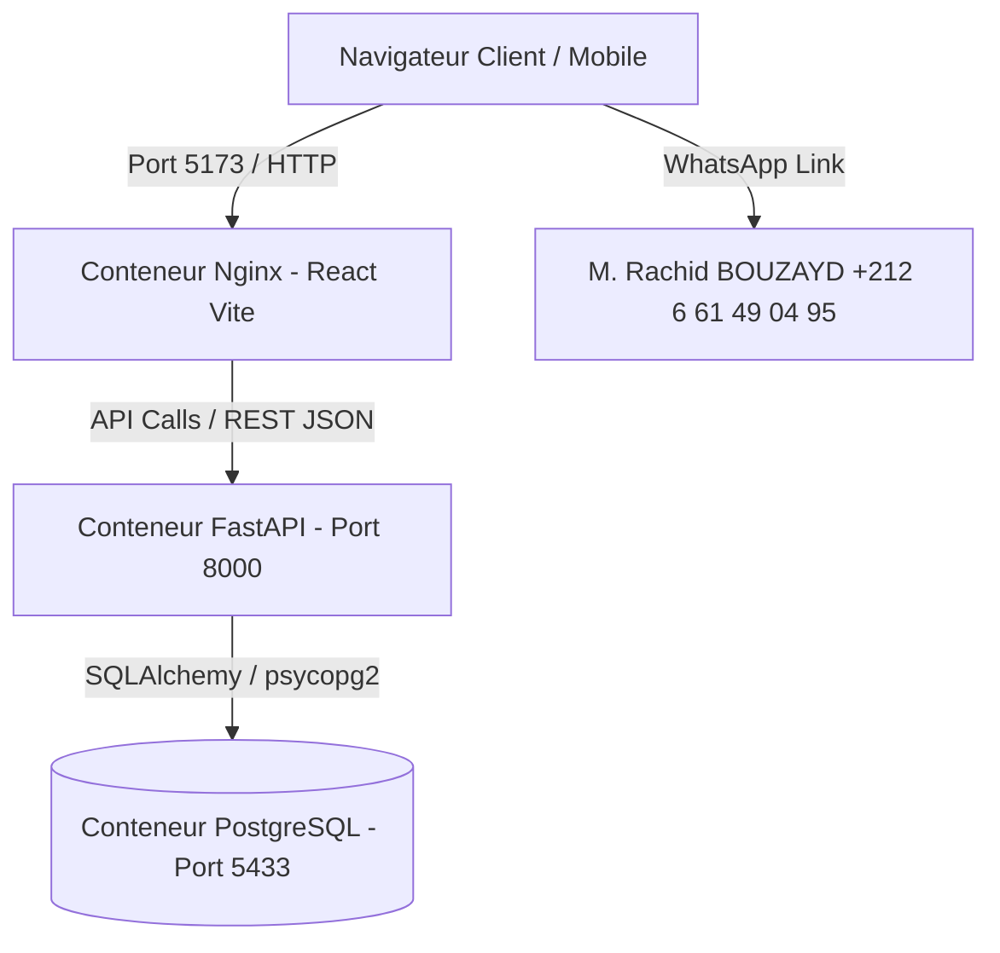

# ⚙️ TENIRA TRAVAUX — Guide Complet d'Installation & Déploiement Fullstack

Ce document décrit l'architecture complète, l'environnement Docker, la base de données PostgreSQL et les étapes pour faire fonctionner la plateforme locale ou la déployer sur Render.

---

## 🏗️ Architecture Technique



- **Frontend :** Interface React 18, Vite, Tailwind CSS au design StoreDeutsch épuré, empaquetée dans `tenira_frontend` (Nginx Alpine).
- **Backend :** API RESTful FastAPI (Python 3.11), SQLAlchemy, Pydantic, auto-documentée sur `/docs` (Swagger UI), dans `tenira_backend`.
- **Base de Données :** PostgreSQL 15 dans `tenira_postgres` avec seeding initial de tous les gaz et postes du flyer.

---

## 🚀 Démarrage Rapide en Local

### 1. Démarrer toute la stack avec Docker Compose

```powershell
cd C:\Users\HP\.gemini\antigravity\scratch\tenira-travaux
docker compose up -d --build
```

Vérifier que les conteneurs tournent :
```powershell
docker ps --filter "name=tenira"
```

Les services sont accessibles immédiatement :
- 🌐 **Site E-commerce & Vitrine :** [http://localhost:5173/](http://localhost:5173/)
- 📑 **API Documentation (Swagger UI) :** [http://localhost:8000/docs](http://localhost:8000/docs)
- 📊 **Dashboard & Administration :** [http://localhost:5173/admin.html](http://localhost:5173/admin.html) ou directement [admin.html](file:///C:/Users/HP/.gemini/antigravity/scratch/tenira-travaux/admin.html)

---

## ☁️ Déploiement sur Render (1 Clic Blueprint)

1. Connectez votre dépôt GitHub sur [dashboard.render.com](https://dashboard.render.com).
2. Sélectionnez **New +** > **Blueprint**.
3. Pointez vers le fichier `render.yaml` situé à la racine du projet.
4. Render provisionnera automatiquement :
   - Le **Static Site** pour le Frontend (sans consommer de quota serveur).
   - Le **Web Service Docker** pour l'API FastAPI.
   - L'instance managée **PostgreSQL**.
